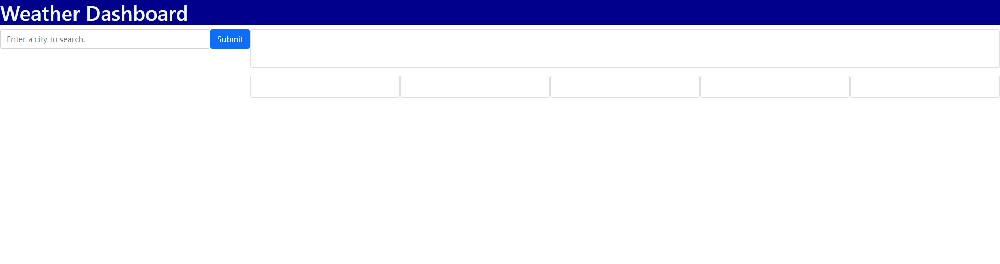

# Weather Dashboard
## Description

The goal of this project was to create a simple to use weather tracker that captures city entered via user input and displays current weather conditions alongside the following 5 day forecast.

## Installation

N/A

## Usage

The user enters their desired city into the form and upon entry a button for that city is generated so the user can quickly pull up the same information during later visits to the page. After the form submission or button click the weather for the current day and the following 5 days.

## Credits

Thank you to Leif and Alexis for the instruction required to put this app together.

Thank you Harley and Thomas for the support!

## License

Refer to the license in the GitHub repo.

## Links

Pop Quiz Website: [https://xwhoknowz.github.io/weather-dashboard/]

## Website Sample

